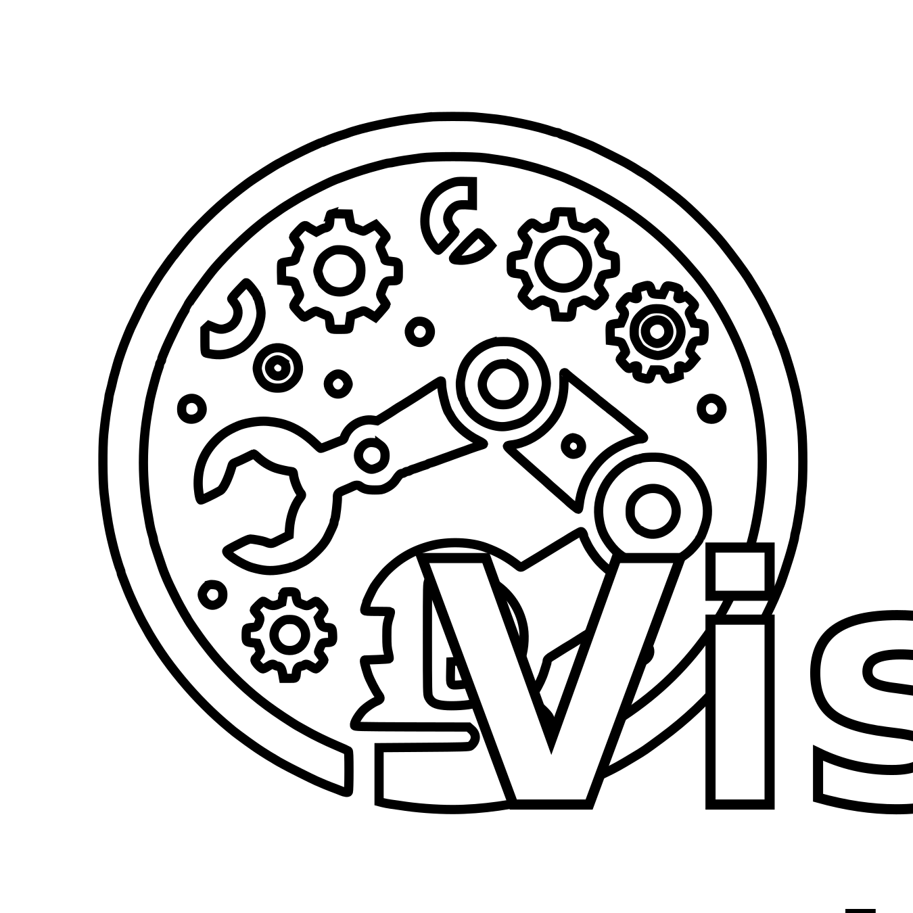

<p align="center">
  
</p>

<p align="center">
  <a href="https://opensource.org/licenses/MIT"></a>
  <a href="https://GitHub.com/eduardo98m/RoboVis/issues/"></a>
  <a href="https://GitHub.com/eduardo98m/RoboVis/pulls/"></a>
</p>

## Table of Contents

- [RoboVis](#robovis)
- [Features](#features)
- [Installation](#installation)
  - [Prerequisites](#prerequisites)
  - [Installing raylib](#installing-raylib)
  - [Installing RoboVis](#installing-robovis)

# RoboVis

RoboVis is a visualization tool designed for robotics simulations. While it is primarily intended to visualize simulations from RoboSim, it is a standalone tool that can be used for a variety of other purposes.

The interfaces in RoboVis are built using [Dear ImGui](https://github.com/ocornut/imgui), and the 3D graphics are rendered using [raylib](https://www.raylib.com/), making it a powerful and flexible tool for any robotics visualization needs.

RoboVis is currently under development. New features and improvements are being added regularly. Please feel free to contribute or 
suggest changes by creating an issue or a pull request.

## Features

* Easy-to-use interface built with Dear ImGui
* High-quality 3D graphics rendered with raylib
* Compatible with RoboSim simulations
* Can be used as a standalone tool for other visualization purposes

## Installation

**Note:** These instructions have been tested on Linux, but there should be no problems following them on Windows (or Mac) as well.

### Prerequisites

Before you begin, ensure you have met the following requirements:

* You have installed the latest version of [raylib](https://www.raylib.com/) and [CMake](https://cmake.org/).

### Installing raylib

Raylib is a simple and easy-to-use library to enjoy videogames programming. Follow these steps to install raylib:

```bash
sudo apt-get update
sudo apt-get install build-essential git cmake xorg-dev libgl1-mesa-dev libasound2-dev
git clone https://github.com/raysan5/raylib.git raylib
cd raylib
mkdir build
cd build
cmake ..
make
sudo make install
```

### Installing RoboVis

To install RoboVis, follow these steps:

1. Clone this repository recursively:

```bash
git clone --recursive https://github.com/eduardo98m/RoboVis.git
```
2. Navigate to the cloned repository:
```bash
cd RoboVis
```

3. Use CMake to build the project:

```bash
mkdir build
cd build
cmake ..
make
```