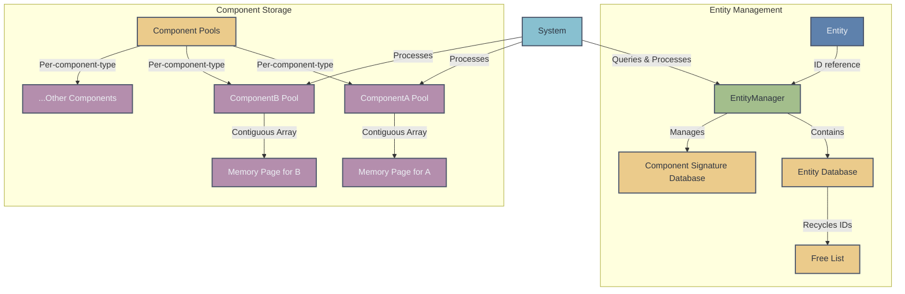

# ECS Framework Overview

This ECS (Entity-Component-System) framework is a data-oriented architecture that separates an entity's identity, its data (components), and behavior (systems). The design prioritizes performance and flexibility by using dense storage for components and fast bitset-based filtering for querying entities.

## Key Concepts

- **Entity**  
  A unique identifier represented by an `id` and a `generation` counter. The generation helps to invalidate stale handles when an entity is destroyed and its ID reused.

- **Component**  
  A piece of data (e.g., position, velocity) attached to an entity. Each component type is assigned a unique ID via a global counter, ensuring fast runtime type checks.

- **ComponentPool**  
  A dense, contiguous storage for a single component type. It maps entities to components and ensures good cache locality by using vectors. When components are removed, a swap‐and‐pop method is used to maintain density.

- **EntityManager**  
  Manages the lifecycle of entities and their associated components. It uses a free list for efficient entity reuse, and maintains a bitset signature for each entity to quickly determine which components are present.

## Architecture Diagram

Below is a diagram that illustrates how the various parts interact:



- **Entity:** Each entity is represented by its ID and signature.
- **ComponentPools:** The EntityManager uses type-erased component pools stored in a map, keyed by the component type.
- **Signatures:** A bitset per entity marks which component types are present, enabling fast queries.

## How It Works

1. **Entity Creation and Destruction**  
   - **Creation:**  
     The `EntityManager::create()` method either reuses an ID from the free list or creates a new entity if none are available. Each entity has an associated generation that is incremented on reuse.
   - **Destruction:**  
     The `destroy()` method removes all components from the entity across all pools, erases its signature, and adds its ID to the free list for later reuse.

2. **Component Management**  
   - **Adding Components:**  
     When you call `addComponent<T>(entity, component)`, the manager:
     - Creates a new `ComponentPool<T>` if one does not exist.
     - Stores the component in a dense vector within the pool.
     - Updates the entity's signature (a bitset) to include this component type.
   - **Accessing Components:**  
     Use `getComponent<T>(entity)` to retrieve a reference to the component stored in its respective pool.

3. **Querying Entities (Views)**  
   The `view<Ts...>()` method builds a bitmask representing the required component types and iterates over a candidate pool (using one of the component types) to find entities whose signatures match the mask. This is how systems can quickly operate on entities that have specific components.

## Example Usage

The following example demonstrates how to use the ECS framework to create entities, add components, and simulate a simple system that processes entities with a `Position` component.

```cpp
#include "EntityManager.hpp"
#include "ComponentType.hpp"
#include "Entity.hpp"
#include <iostream>

// Define a simple Position component.
struct Position {
    float x;
    float y;
};

int main() {
    // Create an EntityManager instance.
    rbvs::EntityManager manager;

    // Create an entity.
    rbvs::Entity entity = manager.create();

    // Add a Position component to the entity.
    manager.addComponent<Position>(entity, Position{10.0f, 20.0f});

    // Retrieve and display the component.
    Position& pos = manager.getComponent<Position>(entity);
    std::cout << "Entity Position: (" << pos.x << ", " << pos.y << ")\n";

    // Simulate a simple system:
    // Get all entities with a Position component.
    auto entitiesWithPosition = manager.view<Position>();

    // It is also possible to get entities with multiple components : 
    // auto entitiesWithPositionAndOrientation = entityManager.view<PositionComponent, OrientationComponent>();
    for (auto e : entitiesWithPosition) {
        Position& p = manager.getComponent<Position>(e);
        // Update position (for example, moving the entity).
        p.x += 1.0f;
        p.y += 1.0f;
        std::cout << "Updated Position: (" << p.x << ", " << p.y << ")\n";
    }

    // Destroy the entity when finished.
    manager.destroy(entity);

    return 0;
}
```

## Using Systems

While this ECS framework does not include an explicit `System` class, systems can be implemented as functions or classes that:
- Query the `EntityManager` using `view<Ts...>()` to obtain entities with specific components.
- Process or update the components of those entities.

For example, you could implement a movement system as a function that iterates over all entities with a `Position` component and updates their positions based on velocity (if you add a `Velocity` component similarly).

## Further Considerations

- **Performance Optimizations:**  
  Dense storage in component pools ensures good cache locality, and the use of bitset signatures allows for fast entity queries. Future improvements might include selecting the smallest candidate pool for views and further minimizing memory allocations.

- **Extensibility:**  
  The ECS framework is designed to be modular. New component types and systems can be added without modifying the core framework. This encourages a clean separation of data and behavior, which is especially beneficial in large-scale simulations and games.

## Conclusion

This ECS framework provides a robust and efficient way to manage entities and their associated data. By leveraging data-oriented design principles, it ensures high performance and scalability for real-time applications like games and simulations.
